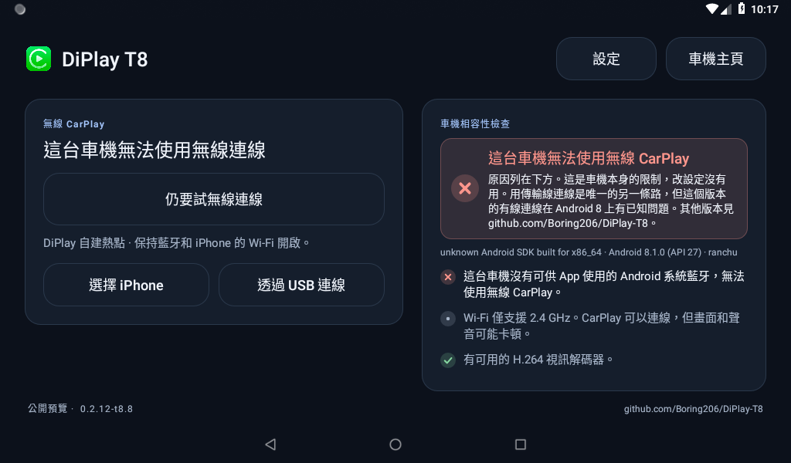
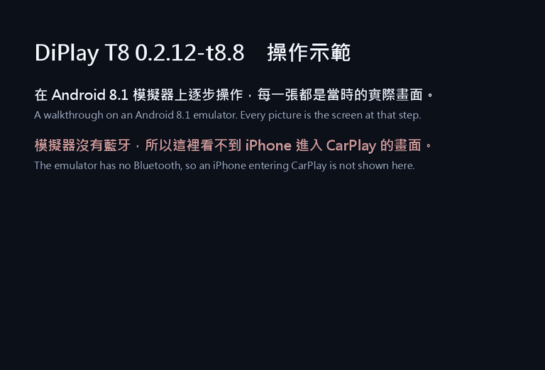
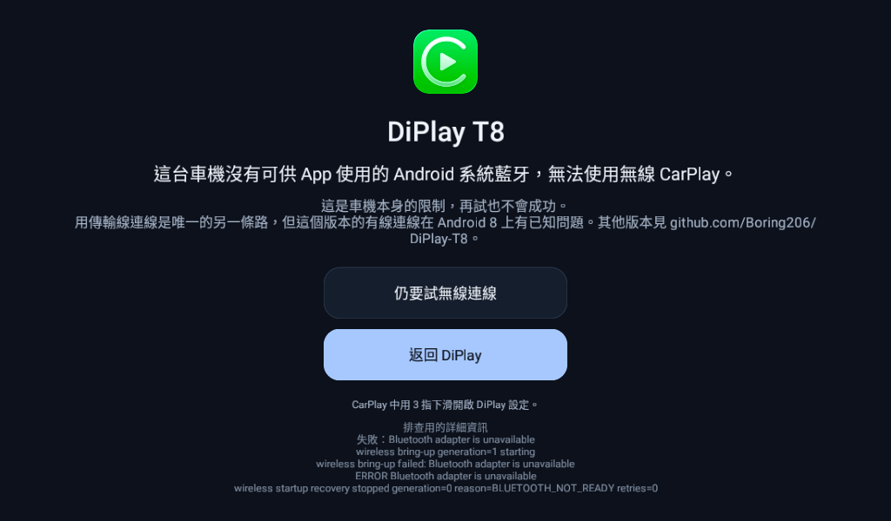

# DiPlay T8：會說出「為什麼連不上」的 DiPlay

> **非官方修改版。** 以 [shihabal3amri/DiPlay](https://github.com/shihabal3amri/DiPlay) 0.2.12 為基礎，用途只有一個：無線 CarPlay 連不上時，在畫面上直接說出原因，例如車機的藍牙 App 用不了、車機自帶的熱點擋住了，或 iPhone 沒有回應。可安裝在 Android 8.1 以上，和原版並存。
>
> **Unofficial fork** of [shihabal3amri/DiPlay](https://github.com/shihabal3amri/DiPlay) 0.2.12 with one purpose: when wireless CarPlay will not connect, it says why on screen, for example Bluetooth that apps cannot use, the car's own hotspot in the way, or an iPhone that does not answer. It installs on Android 8.1 and newer, beside the original app.

**原版負責連上；DiPlay T8 負責在連不上的時候，告訴你為什麼。**
**Upstream is for connecting. DiPlay T8 is for finding out why it will not.**

**[下載 / Download](https://github.com/Boring206/DiPlay-T8/releases/latest)** · [繁體中文](#繁體中文) · [English](#english) · [車機平台整理 / Head unit platforms](docs/HEAD_UNITS.md)



模擬器上的畫面。模擬器沒有藍牙，所以結論是「無法使用」。 / Taken on an emulator, which has no Bluetooth, hence this verdict.

| 用這個版本的實機結果 / Results on real head units with this build | |
|---|---|
| 確認可用 / Confirmed working | **0** |
| 確認不可用 / Confirmed not working | **1**：Allwinner T8，TopWay 韌體。App 當場判定藍牙連線是假的，[實測紀錄](docs/reports/allwinner-t8-topway-2026-10-10.md) / Allwinner T8 with TopWay firmware; the app found its Bluetooth connections not real, [record of the test](docs/reports/allwinner-t8-topway-2026-10-10.md) |
| 其他 / Everything else | 未知，[歡迎回報](https://github.com/Boring206/DiPlay-T8/issues/new/choose) / unknown, [reports welcome](https://github.com/Boring206/DiPlay-T8/issues/new/choose) |

### 操作示範 / Walkthrough



每一張都是 Android 8.1 模擬器上當時的實際畫面，約一分半鐘。同一份示範的影片檔在[發佈頁](https://github.com/Boring206/DiPlay-T8/releases/latest)（`DiPlay-T8-demo.mp4`）。模擬器沒有藍牙，所以**示範裡沒有 iPhone 進入 CarPlay 的畫面**；測了什麼、沒測什麼，見下面的「實際測過什麼」。

Every picture is the real screen at that step on an Android 8.1 emulator; about a minute and a half. The same walkthrough as a video file is on the [release page](https://github.com/Boring206/DiPlay-T8/releases/latest) (`DiPlay-T8-demo.mp4`). The emulator has no Bluetooth, so **no iPhone entering CarPlay is shown**; see "What was actually exercised" below for what was and was not tested.

---

## 繁體中文

### 先裝原版，連不上再裝這個

原版 DiPlay 從 0.2.15（2026-10-08）起可以裝在 Android 7.1 以上，更新也比這裡快。這個版本不是用來取代它的：它是原版一直停在「正在連線」、又看不出原因時，拿來找原因用的。

| 車機實際的 Android 版本 | 建議 |
|---|---|
| 7.1 以上 | 先裝[原版 DiPlay 的最新版](https://github.com/shihabal3amri/DiPlay/releases)。 |
| 8.1 以上，而且原版的無線連不上 | 加裝 DiPlay T8，看首頁的檢查卡片和連線畫面寫的原因。兩個 App 可以並存。 |
| 4.4 到 7.0 | [DiPlay-Legacy-Android](https://github.com/programmerguohuajing/DiPlay-Legacy-Android/releases) v0.2.18 以上。 |

**設定頁寫的 Android 版本不一定是真的。** 不少副廠車機顯示 9、10 甚至 12，實際是 8.1 或更舊。DiPlay T8 首頁檢查卡片上、結論下面那一行小字，是系統自己回報的版本，例如 `Android 8.1.0 (API 27)`；以 API 數字為準。安裝時出現「解析套件時發生問題」，代表實際版本比那個安裝檔要求的還舊。

### 哪些車機能用無線 CarPlay

**看的是藍牙怎麼做的，不是品牌、型號或晶片。**

無線 CarPlay 的第一步，是 App 透過 Android 系統藍牙連到 iPhone。很多副廠車機的電話和音樂走的是另一顆由廠商程式控制的藍牙模組，Android 這一側的藍牙，App 用不了。這種車機不管裝哪一個 DiPlay，無線都不會成功。同一個品牌會賣好幾種主機板，同一顆晶片也會因為韌體不同而有兩種結果，所以沒辦法列出「支援的型號」。

在車上可以自己確認三件事：

1. 平常打電話、聽音樂，是在 **Android 系統設定的藍牙頁**配對，還是在車機另一個「藍牙」或「電話」App 裡？是後者的話，多半不行。
2. Android 系統設定裡的藍牙開關**開得起來**嗎？
3. 在那一頁**搜尋得到 iPhone，並且配對得起來**嗎？

三項都過也只代表可以試。確定的答案要實際連一次：DiPlay T8 會在連線時測試，並把結果留在首頁。

下表是從公開的論壇、韌體檔和 issue 整理出來的 Android 8.1 平台現況，出處和細節在 [docs/HEAD_UNITS.md](docs/HEAD_UNITS.md)。除了第一列，都沒有用這個版本實測過。

| 平台（Android 8.1） | 藍牙 | 無線 CarPlay 的展望 |
|---|---|---|
| Allwinner T8，TopWay 韌體（系統版本 `V9.3.1_…`，MCU `T8.3.19-…`） | 廠商模組 | **不行**（本專案作者的車機實測） |
| Allwinner T3L 和 STM32 的「T8」、TopWay TS9、Rockchip PX30／PX6（MCU 以 `MTCE` 開頭）、SC9853i（Joying、Teyes SPRO） | 廠商模組 | 多半不行，沒有人實測 |
| Unisoc SC7731E／UIS8141E（主機板 `sp7731e_1h10`，含 TopWay TS7） | Android 系統藍牙 | **有成功紀錄**，用的是別的 DiPlay 版本（原版 [#274](https://github.com/shihabal3amri/DiPlay/issues/274)、[#315](https://github.com/shihabal3amri/DiPlay/issues/315)） |
| AutoChips AC8227L（`8227L_demo`，畫面常寫 Android 9 到 12） | 多半是 Android 系統藍牙 | 有可能，沒有人回報過無線 |
| Android 8.1 的一般手機或平板 | Android 系統藍牙 | 有可能，沒有人回報 |

Android 9 以上的平台請用原版；其中同樣有藍牙被廠商封住的，文件裡一併列出。

### 安裝

1. 先裝一個帶有 CarPlay 認證資料的 DiPlay，二選一（兩者套件名稱相同，不能同時安裝）：
   - [原版 DiPlay 0.2.15](https://github.com/shihabal3amri/DiPlay/releases/tag/v0.2.15) 以上。建議用這個，已在 Android 8.1 模擬器上驗證可以當作來源。
   - 或 [DiPlay-Legacy-Android](https://github.com/programmerguohuajing/DiPlay-Legacy-Android/releases) v0.2.7，或 v0.2.18 以上。**不要用 v0.2.14 到 v0.2.17**，那幾版的認證資料有問題。

   本專案的安裝檔**不含**認證資料，第一次啟動時會從已安裝的那個 App 複製。
2. 從 [Releases](https://github.com/Boring206/DiPlay-T8/releases/latest) 下載 `DiPlay-T8.apk` 安裝。它會以「DiPlay T8」的名稱和原本的 App 並存。
3. 在車機的**系統藍牙設定**和 iPhone 配對。只在廠商的電話 App 裡配對是不夠的。
4. 關閉 iPhone 的個人熱點，開啟 DiPlay T8，先看右邊的檢查卡片，再按「連線手機」。

CarPlay 不需要車機有網路：車機開一個沒有網路的 Wi-Fi 給 iPhone 連，只用來傳畫面和聲音；地圖和音樂用的是 iPhone 自己的行動網路。

### 首頁的檢查卡片

| 卡片上的結論 | 意思 |
|---|---|
| 這台車機無法使用無線 CarPlay | 缺了改設定也補不回來的東西：沒有 Android 藍牙、藍牙回報的連線是假的、沒有 Wi-Fi，或沒有視訊解碼器。原因列在結論下面。 |
| 還不能連線 | 有事情要先處理，例如還沒配對、定位沒開、車機自帶的熱點擋住了。每一項下面有對應的按鈕。 |
| 可以試試看 | 事先能檢查的都沒有問題。藍牙是否真的連得到 iPhone，要連一次才知道。 |
| 這台車機可以使用無線 CarPlay | 之前已經成功連上過。 |

「藍牙回報的連線是假的」要三件事同時成立才會成立：連線在 0.1 秒內就回報成功、之後 12 秒 iPhone 沒有傳回任何資料，而且連一個不存在的服務也同樣立刻成功。判定之後首頁會一直顯示這個結論，App 也不再自動連線，因為每次連線都會先把車機的 Wi-Fi 佔走。按「仍要試無線連線」可以重測，只要 iPhone 有回應，結論就會撤銷。

這項判定在一台實車上跑過（Allwinner T8，2026-10-10）：藍牙 6 毫秒就回報連上，之後 12 秒沒有收到任何資料，連一個不存在的服務也在 12 毫秒內「成功」。[完整紀錄在這裡](docs/reports/allwinner-t8-topway-2026-10-10.md)。還沒有在藍牙正常的車機上確認過它不會誤判。

### 連線畫面的訊息



| 畫面顯示 | 意思 | 怎麼辦 |
|---|---|---|
| 這台車機沒有可供 App 使用的 Android 系統藍牙 | 車機沒有 Android 藍牙 | 無線不可行 |
| 系統藍牙回報“已連線”，但實際上沒有連到 iPhone | 藍牙多半是廠商模組的外殼 | 無線不可行 |
| 車機的藍牙是關閉的，DiPlay 無法自動開啟它 | 藍牙關著 | 按「開啟藍牙設定」開啟後返回 |
| 系統藍牙還沒有和 iPhone 配對 | 沒配對或配對失效 | 按「開啟藍牙設定」配對後返回 |
| 藍牙連上了，但 iPhone 沒有回應 | iPhone 在等你確認，或關閉了 CarPlay；也可能是上面那種藍牙，只是沒被判定出來 | 看 iPhone 的提示；檢查 設定 › 一般 › CarPlay |
| 車機自帶的熱點正開著 | 車機自己的熱點擋住 App 的熱點 | 按「選擇處理方式」 |
| DiPlay 裡儲存的 Wi-Fi 名稱，不是車機現在連線的那個網路 | 選了「現有 Wi-Fi」，但名稱填的不是車機連著的那一個 | 按「開啟連線設定」改正，或改用其他連線方式 |
| 車機現在沒有連線任何 Wi-Fi | 選了「現有 Wi-Fi」，但車機沒連上 | 先在系統設定連上，或改用其他連線方式 |
| 車機目前連線著 iPhone 的個人熱點 | 這時不會自動連線 | 關閉個人熱點後按「連線手機」 |

### 已知限制

- **有線 USB 在 Android 8 上有問題。** Android 9 以前，系統不接受一次讀取超過 16 KB 的 USB 資料，這個版本的有線連線會因此失敗。原版在 0.2.15 之後已經修正（[#478](https://github.com/shihabal3amri/DiPlay/pull/478)、[#495](https://github.com/shihabal3amri/DiPlay/pull/495)），截至 2026-10-09 還沒有發佈，也還沒有移植到這裡。Android 8 要用有線，請等原版 0.2.15 之後的版本，或試 DiPlay-Legacy-Android v0.2.19 以上。
- **通話和 Siri 的麥克風在 Android 9 以下可能沒有聲音**，因為系統通常沒有內建的 Opus 編碼器。原版同樣已修正（[#468](https://github.com/shihabal3amri/DiPlay/pull/468)）但尚未發佈，這裡還沒有。
- 以 0.2.12 為基礎。原版之後的介面改版和其他修正都不在這裡。
- 還沒有任何 Android 8.1 實機用這個版本完整進入 CarPlay。

### 還是連不上

- **設定 → 診斷 → 檢視報告**，不需要儲存空間就能看。
- 車機和電腦或手機在同一個 Wi-Fi 時，用瀏覽器開 `http://<車機 IP>:8765/` 可以讀到同一份報告，內含最近 8 次連線紀錄。報告只在 App 開著時提供，並已遮蔽位址。

### 回報你的車機

能用或不能用都很有幫助，同型車機的人可以少走冤枉路；目前最缺的是「能用」的回報。請到 [Issues](https://github.com/Boring206/DiPlay-T8/issues/new/choose) 選「車機回報」。最省事的做法是拍一張首頁的照片：結論、原因、車機型號和版本都在同一個畫面上。這是個人維護的專案，維護者自己的車機就是那台不能用的，不保證能回覆或修正。

### 和原版比，這個版本還剩什麼

對照的是原版在 2026-10-09 的原始碼（0.2.15 之後的 `main`）。原版後來自己也加了 Android 7.1 以上的支援、繁體中文和熱點優先用 IPv4，那幾項已經不算差異。

| | 原版 DiPlay | DiPlay T8 |
|---|---|---|
| 最低 Android 版本 | 7.1 | 8.1 |
| 連線前的車機檢查，給一個結論 | 沒有 | 有 |
| 判定「藍牙回報的連線是假的」並記住 | 沒有（只把藍牙狀態寫進紀錄） | 有 |
| 先查藍牙，再動車機的 Wi-Fi | 先開熱點，再查藍牙 | 有；藍牙關著時還會自動開啟（Android 11 以下） |
| Android 8／9 不用輸入名稱密碼的自建熱點 | 沒有（要輸入車機熱點的名稱密碼，或用現成的 Wi-Fi） | 有 |
| 車機自帶的熱點開著時，由 App 處理 | 沒有 | 有，三種方式 |
| 同一個 Wi-Fi 上用瀏覽器讀診斷報告 | 沒有 | 有 |
| 安裝檔裡的 CarPlay 認證資料 | 內含 | 不含，從已安裝的原版複製 |
| Android 8 的有線 USB | 已修正，尚未發佈 | 有已知問題 |
| Android 9 以下的通話與 Siri 麥克風 | 已修正，尚未發佈 | 可能沒有聲音 |
| 0.2.12 之後的介面改版、深淺色主題、更新檢查 | 有 | 沒有 |
| 維護 | 很活躍，幾乎每天發佈 | 一個人，有空才做 |

所以分工很單純：**要連上 CarPlay，用原版；原版連不上、想知道是車機不行還是設定沒弄好，加裝這個。**

### 實際測過什麼

1,243 項單元測試全數通過。下面是實際操作過的部分，除了標明實車的那一列，都在 Android 8.1 模擬器上。

| 功能 | 怎麼測的 | 結果 |
|---|---|---|
| 覆蓋安裝舊版、全新安裝 | 模擬器 | 通過 |
| 從已安裝的原版 0.2.15 複製認證資料；裝好後回到 App 自動恢復 | 模擬器 | 通過 |
| 首頁的車機檢查與結論 | 模擬器（沒有藍牙，所以是「無法使用」）；另外三種結論只有單元測試 | 通過 |
| 沒有藍牙時按連線：直接說明，車機的 Wi-Fi 不被打斷 | 模擬器；連線前後 Wi-Fi 都維持連線 | 通過 |
| 連線畫面的原因與下一步 | 模擬器（「沒有藍牙」這一種）；其他原因只有單元測試 | 通過 |
| USB 模式的等待畫面 | 模擬器，沒有接 iPhone | 畫面正常；實際的有線連線沒有測 |
| 診斷報告：App 內檢視、同一個 Wi-Fi 上讀取 | 模擬器 | 通過 |
| App 自建熱點 | 模擬器、略過藍牙的測試版、一支模擬手機：加入熱點、取得 IP、用 mDNS 找到 CarPlay 服務、連上 7000 埠得到 `200 OK` | 通過 |
| 車機熱點開著：由 App 關閉後自建熱點 | 同上 | 通過 |
| 車機熱點開著：輸入名稱密碼直接使用 | 同上 | 通過 |
| 寬螢幕、直向、小螢幕三種版面 | 模擬器 | 通過 |
| 「藍牙連線是假的」的判定、判定後停止不再重試、首頁記住結果、自動開啟藍牙 | **實車**（Allwinner T8，t8.8，2026-10-10），[紀錄](docs/reports/allwinner-t8-topway-2026-10-10.md) | 通過。還沒有在藍牙正常的車機上確認不會誤判 |
| 「現有 Wi-Fi」設定錯誤時說明原因並停下來 | 模擬器加略過藍牙的測試版；問題本身是在實車上發現的 | 通過 |
| iPhone 的畫面、聲音和觸控；有線連線；麥克風 | 沒有測 | **需要真的車機和 iPhone** |

沒有合適的車機也可以幫忙補上最後一列：任何 Android 8.1 以上、藍牙正常的舊手機或平板都可以當接收端，裝上原版和 DiPlay T8，用 iPhone 連連看，再把結果[回報](https://github.com/Boring206/DiPlay-T8/issues/new/choose)。

### 自行編譯

需要 JDK 與 Android SDK／NDK，細節見 [docs/BUILD.md](docs/BUILD.md)（這個分支用的 NDK 版本寫在 `shared/build.gradle`）。

```sh
ANDROID_KEYSTORE_PATH=... ANDROID_KEY_ALIAS=... ANDROID_KEYSTORE_PASSWORD=... ANDROID_KEY_PASSWORD=... \
  ./gradlew :mobile:assembleRelease
```

不設定 `DIPLAY_AUTH_ASSETS_DIR` 時，產出的安裝檔不含認證資料，和 Releases 裡的相同。單元測試：`./gradlew :shared:testDebugUnitTest :common:testDebugUnitTest`。

---

## English

### Install upstream first; add this one when it will not connect

Upstream DiPlay installs on Android 7.1 and newer since 0.2.15 (2026-10-08) and moves faster than this fork. This build does not replace it. It is for the case where upstream sits on "Connecting" and gives no reason.

| Real Android version of the head unit | What to install |
|---|---|
| 7.1 or newer | The [latest upstream DiPlay](https://github.com/shihabal3amri/DiPlay/releases) first. |
| 8.1 or newer, and upstream will not connect wirelessly | Add DiPlay T8 and read the check card on its home page and the cause on its connecting screen. The two apps install side by side. |
| 4.4 to 7.0 | [DiPlay-Legacy-Android](https://github.com/programmerguohuajing/DiPlay-Legacy-Android/releases) v0.2.18 or newer. |

**The Android version on a unit's settings page is often not the real one.** Many aftermarket units show 9, 10 or even 12 and run 8.1 or older. The small line under the verdict on DiPlay T8's check card is what the system itself reports, for example `Android 8.1.0 (API 27)`; go by the API number. "There was a problem parsing the package" on install means the real version is older than that APK needs.

### Which head units can do wireless CarPlay

**It depends on how Bluetooth is built, not on the brand, the model or the chip.**

Wireless CarPlay starts with the app reaching the iPhone through Android's own Bluetooth. On many aftermarket units, calls and music run on a separate Bluetooth module driven by the maker's software, and the Android side is something apps cannot use. Wireless cannot work on those with any DiPlay build. One brand sells several boards, and one chip gives both results under different firmware, so a list of "supported models" is not possible.

Three things an owner can check in the car:

1. Are calls and music paired on the **Bluetooth page of Android's system settings**, or in a separate "Bluetooth" or "Phone" app from the maker? If the latter, it most likely will not work.
2. Does the Bluetooth switch in Android's system settings **turn on**?
3. Does that page **find the iPhone and complete pairing**?

Passing all three only means it is worth trying. The answer comes from one real connection: DiPlay T8 tests during it and keeps the result on the home page.

The table is what public forums, firmware images and issues say about Android 8.1 platforms; sources and details are in [docs/HEAD_UNITS.md](docs/HEAD_UNITS.md). Apart from the first row, none was tested with this build.

| Platform (Android 8.1) | Bluetooth | Outlook for wireless CarPlay |
|---|---|---|
| Allwinner T8 with TopWay firmware (system version `V9.3.1_…`, MCU `T8.3.19-…`) | maker's module | **Does not work** (tested on the maintainer's unit) |
| Allwinner T3L and the STM32 "T8", TopWay TS9, Rockchip PX30/PX6 (MCU starting `MTCE`), SC9853i (Joying, Teyes SPRO) | maker's module | Unlikely; nobody has tried |
| Unisoc SC7731E / UIS8141E (board `sp7731e_1h10`, including TopWay TS7) | Android's own stack | **Has worked**, with other DiPlay builds (upstream [#274](https://github.com/shihabal3amri/DiPlay/issues/274), [#315](https://github.com/shihabal3amri/DiPlay/issues/315)) |
| AutoChips AC8227L (`8227L_demo`, often labelled Android 9 to 12) | mostly Android's own stack | Possible; no wireless attempt reported |
| An ordinary Android 8.1 phone or tablet | Android's own stack | Possible; nobody has reported one |

Owners of Android 9 and newer platforms should use upstream; some of those also have Bluetooth closed off by the maker, and the document lists them.

### Install

1. Install a DiPlay that carries the CarPlay identity, one of the two (they share a package name and cannot both be installed):
   - [Upstream DiPlay 0.2.15](https://github.com/shihabal3amri/DiPlay/releases/tag/v0.2.15) or newer. Preferred; checked as a source on an Android 8.1 emulator.
   - Or [DiPlay-Legacy-Android](https://github.com/programmerguohuajing/DiPlay-Legacy-Android/releases) v0.2.7, or v0.2.18 or newer. **Not v0.2.14 to v0.2.17**: their identity files are faulty.

   This project's APK carries **no** CarPlay identity; on first launch it copies the identity from that installed app.
2. Install `DiPlay-T8.apk` from [Releases](https://github.com/Boring206/DiPlay-T8/releases/latest). It appears as "DiPlay T8" beside the other app.
3. Pair the iPhone in the head unit's **system Bluetooth settings**. Pairing only in the maker's phone app is not enough.
4. Turn Personal Hotspot off on the iPhone, open DiPlay T8, read the check card on the right, then tap Connect phone.

The head unit needs no internet for CarPlay: it opens a Wi-Fi network without internet that only carries picture and sound, while maps and music use the iPhone's own mobile data.

### The check card on the home page

| Verdict on the card | Meaning |
|---|---|
| This head unit cannot use wireless CarPlay | Something no setting brings back is missing: no Android Bluetooth, Bluetooth whose connections are not real, no Wi-Fi, or no video decoder. The reason is listed under the verdict. |
| Not ready to connect yet | Something needs doing first, such as pairing, switching location on, or the car's own hotspot being in the way. Each item has its button. |
| Ready to try | Everything that can be checked in advance passed. Whether Bluetooth really reaches the iPhone only shows in a connection. |
| Wireless CarPlay works on this head unit | It has connected here before. |

"Connections that are not real" needs three things at once: the connection reports success within 0.1 s, the iPhone then sends nothing for 12 s, and a connection to a service that does not exist succeeds just as fast. After that the home page keeps showing the verdict and the app stops connecting by itself, because every attempt takes the unit's Wi-Fi first. "Try wireless anyway" repeats the test, and one answer from the iPhone withdraws the verdict.

The test has run on one real unit (Allwinner T8, 2026-10-10): Bluetooth reported a connection after 6 ms, nothing arrived in the next 12 s, and a connection to a service that does not exist also "succeeded" after 12 ms. [The full record is here](docs/reports/allwinner-t8-topway-2026-10-10.md). It has not yet been run on a unit with working Bluetooth to confirm it never fires there.

### Messages on the connecting screen

The screen names the cause: no Android Bluetooth, Bluetooth whose connections are not real, Bluetooth off or unpaired, an iPhone that does not answer, the car's own hotspot in the way, the unit still joined to the iPhone's Personal Hotspot, or, with "Existing Wi-Fi" chosen, a saved Wi-Fi name that is not the network the unit is on. Each comes with the next step where there is one. "Bluetooth connected, but the iPhone did not answer" can also be the not-real kind of Bluetooth that the test did not catch.

### Known limits

- **Wired USB is faulty on Android 8.** Before Android 9 the system refuses USB reads larger than 16 KB, and this build's wired path asks for more. Upstream fixed it after 0.2.15 ([#478](https://github.com/shihabal3amri/DiPlay/pull/478), [#495](https://github.com/shihabal3amri/DiPlay/pull/495)); as of 2026-10-09 that is unreleased and not ported here. For a cable on Android 8, wait for the upstream release after 0.2.15 or try DiPlay-Legacy-Android v0.2.19 or newer.
- **The microphone for calls and Siri may be silent below Android 10**, where the system usually has no Opus encoder. Upstream fixed that too ([#468](https://github.com/shihabal3amri/DiPlay/pull/468)), also unreleased; this build has not.
- Based on 0.2.12. Upstream's later interface redesign and other fixes are not here.
- No Android 8.1 unit has completed a CarPlay session with this build yet.

### When it does not connect

**Settings → Diagnostics → View report** needs no storage. With the head unit and another device on the same Wi-Fi, `http://<head unit IP>:8765/` serves the same redacted report, including the last eight connection logs, while the app is open.

### Report your head unit

A report helps whether it worked or not: owners of the same unit learn what to expect, and reports of success are what is missing most. Open [an issue](https://github.com/Boring206/DiPlay-T8/issues/new/choose) and choose "Head unit report". The easiest way is a photo of the home page: verdict, reasons, unit and version are all on that one screen. One person maintains this in spare time, and their own head unit is the one that cannot run it; an answer or a fix is not promised.

### What this build still has that upstream does not

Compared with upstream's source on 2026-10-09 (`main` after 0.2.15). Upstream has since added Android 7.1 support, Traditional Chinese and IPv4 first on hotspots itself, so those no longer count.

| | Upstream DiPlay | DiPlay T8 |
|---|---|---|
| Minimum Android | 7.1 | 8.1 |
| A head unit check before connecting, with one verdict | no | yes |
| A test for Bluetooth connections that are not real, remembered afterwards | no (Bluetooth state goes to the log only) | yes |
| Bluetooth checked before the unit's Wi-Fi is touched | hotspot first, Bluetooth after | yes, and Bluetooth is switched on by the app up to Android 11 |
| An app-owned hotspot on Android 8 and 9, nothing to type | no (type the car hotspot's name and password, or use an existing Wi-Fi) | yes |
| Handling the car's own hotspot when it is on | no | yes, three ways |
| The diagnostic report in a browser on the same Wi-Fi | no | yes |
| CarPlay identity inside the APK | bundled | not bundled; copied from the installed original |
| Wired USB on Android 8 | fixed, not released yet | known fault |
| Microphone for calls and Siri below Android 10 | fixed, not released yet | may be silent |
| The interface redesign, light and dark themes and update check after 0.2.12 | yes | no |
| Maintenance | very active, a release almost daily | one person, in spare time |

So the split is simple: **to get CarPlay running, use upstream; when upstream will not connect and you want to know whether it is the unit or a setting, add this one.**

### What was actually exercised

All 1,243 unit tests pass. The rows below were done by hand, on an Android 8.1 emulator except for the row marked as a real unit.

| Feature | How | Result |
|---|---|---|
| Update over an older version; clean install | emulator | pass |
| Copying the identity from an installed upstream 0.2.15; recovery on return after installing it | emulator | pass |
| The head unit check and its verdict | emulator (no Bluetooth, so "cannot"); the other three verdicts by unit tests only | pass |
| Connect with no Bluetooth: an explanation, and the unit's Wi-Fi is left alone | emulator; Wi-Fi stayed connected before and after | pass |
| Cause and next step on the connecting screen | emulator (the "no Bluetooth" cause); other causes by unit tests only | pass |
| The waiting screen of USB mode | emulator, no iPhone attached | screen correct; a real wired connection was not tested |
| The report: in the app, and from the same Wi-Fi | emulator | pass |
| The app-owned hotspot | emulator, a test build that skips Bluetooth, and a simulated phone: joined, got an address, found the CarPlay service by mDNS, got `200 OK` from port 7000 | pass |
| Car hotspot on: the app turns it off and opens its own | same | pass |
| Car hotspot on: its name and password typed, used as it is | same | pass |
| Wide, portrait and small-screen layouts | emulator | pass |
| The "connections that are not real" test, stopping without retries afterwards, the home page remembering it, switching Bluetooth on | **a real unit** (Allwinner T8, t8.8, 2026-10-10), [record](docs/reports/allwinner-t8-topway-2026-10-10.md) | pass. Not yet run on a unit with working Bluetooth to confirm it never fires there |
| "Existing Wi-Fi" set up wrongly: the cause is named and the attempt stops | emulator with the test build that skips Bluetooth; the fault itself was found on the real unit | pass |
| Picture, sound and touch from an iPhone; the cable; the microphone | not tested | **needs a real head unit and an iPhone** |

You can help fill the last row without a suitable head unit: any old Android 8.1+ phone or tablet with ordinary Bluetooth can act as the receiver. Install upstream and DiPlay T8 on it, connect an iPhone, and [report](https://github.com/Boring206/DiPlay-T8/issues/new/choose) what happened.

### Build

See [docs/BUILD.md](docs/BUILD.md) for the toolchain (this branch's NDK version is in `shared/build.gradle`). `./gradlew :mobile:assembleRelease` with the `ANDROID_KEYSTORE_*` variables signs a release; without `DIPLAY_AUTH_ASSETS_DIR` the APK carries no identity, like the published one. Unit tests: `./gradlew :shared:testDebugUnitTest :common:testDebugUnitTest`.

### License and credits

Same licenses as upstream (GPL-3.0, with AGPL-3.0 parts noted below). All credit for DiPlay goes to its authors; this fork only adapts it. Not affiliated with Apple or with the upstream project.

The original README of 0.2.12 follows.

---

# DiPlay

**CarPlay for compatible BYD Android head units.** Wired and wireless, with the familiar DiAuto interface. Independent app: `com.shihab.diplay`.

> **BYD support scope:** These projects focus on BYD cars. They may work on other brands, but other brands are unsupported and there are no plans to add support or fix brand-specific incompatibilities.

[Download & website](https://shihabal3amri.github.io/DiPlay/) · [Release](https://github.com/shihabal3amri/DiPlay/releases/tag/v0.2.12) · [Report a problem](https://github.com/shihabal3amri/DiPlay/issues/new/choose)


## 0.2.12 — public preview

Install on the **car**, not the iPhone. No jailbreak, dongle, Mac, account or authentication server is required for use. Core CarPlay does not require ADB; optional dashboard, battery, wheel-speed and parked-video features do. Your head unit must permit APK installation. Wireless supports Wi-Fi Direct, the car’s existing hotspot or Existing Wi-Fi / Same LAN; Wi-Fi Direct requires Android 10+; the APK supports Android 9+ for wired use.

- Wired USB and wireless CarPlay with local authentication.
- BYD HUD navigation with arrows, distance and street names on verified firmware.
- Car hotspot support, improved audio buffering and saved receive diagnostics.
- Automatic address discovery, fixed-channel Wi-Fi fallbacks and successful-configuration memory.
- Icon/text size, resolution and frame rate; applying a display change reconnects CarPlay.
- Local diagnostic export. Reports are sent only if you choose to share them.
- Separate installation alongside DiAuto. Run one projection app at a time.

This is **not an Apple-certified product**. The APK bundles an experimental accessory identity recovered from public Carlinkit firmware, not a newly provisioned MFi identity for DiPlay. A bundled private key is extractable. Acceptance after future iOS updates, reliability across head units and suitability of that identity for general distribution are unresolved. This release invites community testing; it is not a guarantee of universal compatibility.

Earlier releases were tested on the development DiLink5.1 car: live windshield guidance and street names work, Car hotspot now starts CarPlay, and Wi-Fi Direct performance is substantially improved. Occasional audio cutouts remain and are deferred to a later update. The floating-map test build was installed on the development DiLink 5.1 car; feedback led to the pinch corrections in 0.2.9. Earlier wheel-speed and video contributions were tested on a BYD Tang with DiLink 5.0 and an iPhone 15 Pro on iOS 27; wheel-speed dead reckoning in tunnels remains unverified. Broader head-unit and iOS compatibility is not guaranteed. The HUD firmware scope and cleanup limits are documented in [BYD navigation](docs/BYD_NAVIGATION.md).

## What’s new in 0.2.12

- Add Existing Wi-Fi / Same LAN wireless CarPlay with scoped IPv4/IPv6 discovery and network-change cleanup (#223).
- Wait for a stable car-hotspot interface and recover bounded wireless attempts when no AirPlay TCP follows StartSession (#229); add observed-state, authorized-ADB hotspot fallback on firmware exposing supported commands (#235).
- Improve Apple USB attach matching and narrowly scoped optional USB-prompt assistance (#170, #224).
- Pause Android 10 station scans during eligible hotspot/P2P sessions, preserving Same LAN, with controller leases and durable retryable restoration (#225).
- Improve split-screen, launcher cards, short-screen preparation and virtual cluster/floating-map geometry (#171, #172, #181).
- Add independent system-bar controls and correct in-session save/cancel and Local/USB-CH341 authentication selection (#191, #194).
- Add system, light-sensor, day and night CarPlay appearance modes, richer custom turn cards, and live main-video picture controls (#178, #193, #211).
- Offer custom integer resolution from 30% to 160%, with shared limits, correct 30%/160% labels and decoder/canvas capability fallback; refresh connection settings on resume (#179, #230, #196).
- Reconcile opt-in DiLink 4 cluster routing/calibration into one decoder owner, retain verified HUD gates, and journal exact stock-map holds and recovery (#213, #187).
- Add DiLink 3 guidance text and projection-display support with committed recovery before mutation, partial-setup compensation and retryable stock restoration (#182).
- Add opt-in wheel map zoom and main-screen joystick while preserving press/release and call behavior; reject stale queued work across phone/screen changes (#214, #231).
- Switch supported dashboard contents live using actual delivery and safely retained paused choices; preserve selection across stream/phone replacement (#232).
- Add a five-second dashboard-song-on-change window with timer invalidation, and retain album art while the next transfer is pending (#215, #228).
- Export reports through Downloads, document picker, app-external or private fallback storage, with explicit View/Share actions (#185, #219).

See [0.2.12 release notes](docs/RELEASE-NOTES-0.2.12.md) and [validation](docs/VALIDATION.md) for the full reviewed changes, contributor evidence and remaining hardware checks. Higher resolution costs more decoder/GPU work; above 100% is not a recommended default. Supported firmware and authorization are still required for optional BYD paths. General stutter, calls/Siri, iOS 15 startup and model-specific reports remain under investigation.

If a problem remains, reproduce it on **0.2.12**, then use **Settings → Diagnostics → Save diagnostic report**. Android 10+ normally saves to **Downloads/DiPlay**; Android 9 uses the document picker. If unavailable, use **View report** or **Share** from the confirmation, which identifies external/private fallback storage. Review the `.txt` and add it to a matching [existing issue](https://github.com/shihabal3amri/DiPlay/issues), or [create one](https://github.com/shihabal3amri/DiPlay/issues/new/choose). Include vehicle/head-unit model, exact firmware and Android/DiLink, phone/iOS, connection backend, relevant settings, steps and failure time. Reports are shared only when you choose; never post your hotspot password.

## Documentation

[Existing Wi-Fi / Same LAN](docs/EXISTING_WIFI.md) keeps the iPhone and head unit
on an external router. See the guide for setup, build requirements and the
BYD DiLink 4.0 / Android 10 clean-install validation result.

- [Install and connect](docs/INSTALL.md)
- [Compatibility and troubleshooting](docs/COMPATIBILITY.md)
- [Privacy and diagnostic reports](docs/PRIVACY.md)
- [Build from source](docs/BUILD.md)
- [Validation](docs/VALIDATION.md)
- [Release notes](CHANGELOG.md)
- [Credits and licenses](docs/THIRD_PARTY_NOTICES.md)

The website is available in English, Arabic, Russian, Ukrainian, Spanish and Simplified Chinese. The app interface supports those same six languages. Choose the app language in Settings; on Android 13+, it stays synchronized with Android’s per-app language setting.

## Source and credits

Based on [xcertplay](https://github.com/shilapi/xcertplay), GPL-3.0. The home/settings UI and website adapt [DiAuto](https://github.com/shihabal3amri/DiAuto), AGPL-3.0; that license is included in `docs/licenses`. Preserve those notices when distributing modifications. CarPlay and its icon belong to Apple Inc.; no Apple or BYD affiliation or endorsement is implied.

This repository starts with a clean public source snapshot. Local research, tester reports and release-signing secrets are excluded. The complete source corresponding to the APK is provided with every release; experimental runtime identity assets are described separately in the build instructions and notices.

## Local release packaging

The release APK intentionally contains the experimental accessory identity. The Git repository and source archive exclude all accessory and Android signing keys; tests generate synthetic identities at runtime. Source/CI builds omit runtime identity assets by default. Local release builds explicitly select an external asset directory. Publishing the APK makes its bundled identity extractable; building locally does not preserve that identity's confidentiality.
